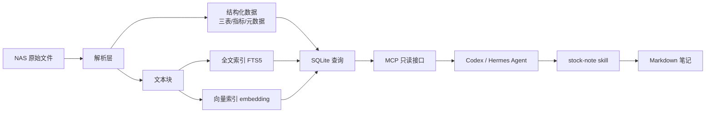
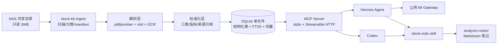

# 财报知识库与股票分析笔记 — 计划与技术方案

> 状态：方案稿（待你确认后开工）
> 生成日期：2026-08-09
> 最近更新：2026-08-15

## 1. 目标

把 NAS（`\\Dxp4800-1305\财报&研报`）里的财报与研报整理成一个**只读知识库**：

- 任何支持 MCP 的 agent（Codex、Hermes Agent 等）都能查询公司报告、三大报表、财务指标和原文片段；
- 通过一个可移植的 agent skill（`stock-note`）生成类似雪球《中国金茂笔记》风格的股票分析笔记；
- 笔记中的关键数字必须能追溯到源文件（文件 + 页码/表名）；
- 试点范围：海底捞（06862.HK）+ 百胜中国（YUMC / 09987.HK），全部可用年份。

## 2. 知识库工作原理（先讲概念）

如果你不熟悉知识库内部是怎么工作的，可以把它理解为一条「把不可查询的文件变成可查询数据」的流水线：

### 2.1 解析层

把 PDF、XLS、HTML 等原始文件变成两样东西：

1. **结构化数据**：利润表、资产负债表、现金流量表、财务比率。它们被归一化成统一的表结构，字段包括科目名、数值、币种、会计准则、来源文件、页码。
2. **文本块**：按页/按章节切开的文字（含 OCR 结果）。这些文本块用于「搜索」和「让模型读原文」。

### 2.2 索引层

索引是为了让查询快，而不是每次搜索都从头读一遍几百页 PDF：

- **全文索引（FTS5）**：类似搜索引擎的关键词匹配，适合精确查找「减值」「翻台率」「同店销售」。注：SQLite FTS5 默认分词器对中文不友好，实现时使用 trigram 分词器（三字滑动切分）或 jieba 预分词，确保中文关键词能精确命中。
- **向量索引（embedding）**：把文本块转换成一组数字（向量），语义相近的内容向量距离也近。用户问「这家公司现金流怎么样」即使原文没有「现金流」三个字，也能检索到相关段落。这套「先向量召回、再让模型读原文回答」的用法就是 **RAG（Retrieval-Augmented Generation，检索增强生成）**。

为什么财务知识库不能只靠向量？

因为财务分析最怕模型「凭印象编数字」。所以我们把三张表单独解析成结构化数据，关键数字直接从结构化数据取，向量检索只负责找「哪段原文在讲什么」，两者结合。

为什么不只靠 grep/FTS5？代码搜索常用 grep，是因为代码由精确符号、路径和结构化语法组成，字面匹配正好命中；而财报是长文本、中英混排、同一含义多种表达（「现金流质量」与「经营现金流量净额」），还常有中文问题要检索英文年报。grep/FTS5 无法做语义和跨语言匹配，所以需要向量索引补位；反过来向量召回可能漏掉精确词，所以两者合并成混合检索，而不是二选一。

### 2.3 接口层（MCP）

MCP（Model Context Protocol）是 agent 与外部工具之间的标准协议，类似 USB-C：只要知识库实现 MCP，任何支持 MCP 的 agent 都能即插即用。

知识库只暴露**只读工具**（查公司、查报告、查三表、搜文本、取原文），不提供写工具，避免 agent 误改数据。

### 2.4 Agent Skill 层

skill 是一组写给 agent 的「操作手册 + 模板」。`stock-note` skill 会告诉 agent：

1. 先用 MCP 查哪些数据；
2. 按什么模板组织笔记；
3. 哪些数字必须带来源引用；
4. 输出到哪里。

这样同一个 skill 在 Codex、Hermes Agent 或其他 agent 上都可以直接复制使用。

## 3. 数据现状（事实调研结果）

### 3.1 试点公司

两家公司共 **60 个文件、约 217 MB**（59 个 PDF + 1 个 Markdown）：

- **海底捞**：34 个 PDF，平铺在根目录
  - 定期报告 16 份：2018 年报/招股书、2019–2025 年报、2019–2025 中报；**全部文本型 PDF，全部包含三大报表**
  - 研报 18 份（国信、东兴、东吴、东方、国盛、平安、招银、星展、浙商、浦银等），均为文本型，多数含财务预测摘要表
  - 报告覆盖 2018–2025
- **百胜中国**：25 个 PDF + 1 个 md，按「年报/招股书/研报」分子目录
  - 美国版年报 10 份（2016–2025）、港股年报 4 份（2022–2025）、中英文招股书 2 份；全部文本型，全部含三大报表
  - 研报 9 份（国信、海通国际、华源证券等）
  - 报告覆盖 2016–2025

### 3.2 关键结论

- **没有整本扫描件**：59 个 PDF 全部有文本层，OCR 目前只是兜底；
- 仅发现 1 份混合型研报（华源证券研报.pdf）含图片型表格页，需要 OCR 才能提取财务预测表；
- 三张表位置已经摸清（例如海底捞 2024 年报：损益表 p.142、财务状况表 p.144、现金流量表 p.149；百胜中国 2025 年报：Income p.112、Balance Sheet p.115、Cash Flow p.114），解析阶段可以按表头+关键词定位，而不是盲扫全文；
- 研报不含完整三表，只含财务预测摘要表 → 入库时标记为「观点层」，不与财报事实混用。

### 3.3 NAS 整体（为后续扩展）

- 32 个公司/主题目录，业务文件 292 个、约 1.18 GiB；
- 格式分布：PDF 为主，另有 XLS 财务矩阵、HTML、CSV、PNG、MD 等；
- 非公司目录（`#recycle`、`Kimi_Agent_5G资本对现金流股价`、`行业研报`）按你的决定**不入库**。

## 4. 总体架构

## 5. 技术选型对比（详细优缺点）

### 5.1 存储与索引方案

| 方案 | 原理 | 优点 | 缺点 | 结论 |
|---|---|---|---|---|
| **SQLite + FTS5 + sqlite-vec**（推荐） | 一个文件同时存结构化数据、全文索引、向量 | 零运维、单文件备份、Docker 里内存占用极低、事务可靠、NAS 8GB 内存完全够用；sqlite-vec 直接存向量无需独立服务 | 向量检索规模到百万级后不如专用向量库；并发写受限（我们只读，无影响） | ✅ 推荐 |
| ChromaDB | 专用嵌入式向量库，Python 原生 | API 简单、生态成熟、支持集合过滤 | 结构化财务数据仍需另存 SQLite，形成两套数据；内存/磁盘占用更大；版本升级快、API 变动多 | 可选，但增加复杂度 |
| LanceDB | 嵌入式向量库，列式存储 | 支持大数据量、无服务、多语言 | 相对年轻；和 FTS/结构化查询的整合不如 SQLite 顺滑 | 可做备选 |
| Qdrant | 独立向量数据库服务 | 功能全、性能强、支持高并发 | 多一个常驻服务，NAS 上多占内存；对 1 万级文档属于杀鸡用牛刀 | 规模扩大后再考虑 |
| PostgreSQL + pgvector | 数据库 + 向量扩展 | 一体化能力强、查询复杂 | 需要在 NAS 跑 Postgres，内存/运维成本高；本地 Windows 试点麻烦 | 不选 |

**结论**：SQLite 单文件方案最贴合「个人 NAS + 少量公司 + 只读查询」，后续迁 Docker 也最简单。

### 5.2 嵌入模型（Embedding Model）

嵌入模型把文本变成向量，决定「语义搜索」质量。候选：

| 模型 | 参数量/体积 | 优点 | 缺点 | 结论 |
|---|---|---|---|---|
| bge-small-zh-v1.5 | 约 100 MB | 中文好、CPU 可跑、DXP-4800（N100/8GB）无压力；增量只嵌入新文件，负载小 | 长文本和英文弱于 BGE-M3 | 评测基线 |
| **thenlper/gte-small-zh** | 约 100 MB | 与 bge-small 同尺寸，C-MTEB 中文表现更好；MIT 许可；CPU 可跑 | 仅中文、512 token 截断 | 同尺寸首选候选 |
| **IEITYuan/Yuan-embedding-2.0-zh** | 0.3B / 约 0.6GB | 中文检索/重排榜单领先（Retrieval 81.76 / Reranking 77.94）；32K 长上下文；Apache-2.0 可商用 | 比 100MB 级模型慢、内存占用高；N100 纯 CPU 可跑但增量耗时增加 | NAS 强模型候选 |
| intfloat/multilingual-e5-small | 约 230 MB | 100+ 语言、支持跨语言检索、体积小、MIT 许可 | 中文单项不如中文专用模型；512 token 上限 | 多语言小候选 |
| **Alibaba-NLP/gte-multilingual-base** | 305M / fp32 约 1.2GB，ONNX int8 约 324MB | 100+ 语言、8192 token、中英跨语言检索强 | 比 100MB 级模型慢，但 NAS 可接受 | 多语言中量级首选候选 |
| Qwen/Qwen3-Embedding-0.6B | 0.6B / 约 1.2GB（fp16），可用 GGUF/ONNX 压缩 | MTEB 多语言榜前列、Apache-2.0、32K 上下文、中英检索强 | 比 100MB 级模型慢；NAS 上属「可跑但偏重」档 | 榜单前列小模型候选 |
| BGE-M3 | 约 2 GB（0.57B） | 100+ 语言、8K 长文本、跨语言检索质量高 | NAS 8GB 内存偏紧；本机 4070 Ti SUPER 跑没问题 | 本机对比候选 |
| OpenAI text-embedding-3-small | API | 质量好、省本地资源 | 需要联网+API Key+按量付费；财报文本出机器 | 不选（隐私/成本） |

**增量策略**：manifest 记录文件哈希，只有新增/变更文件才重新解析和嵌入，不会全量重跑。

### 5.2.1 模型初选策略（MTEB 榜单）

候选不拍脑袋，按以下流程初选：

1. **来源**：MTEB 中文榜（C-MTEB）和 Multilingual 榜当前前列的模型；
2. **硬性过滤**：模型体积 ≤ 约 1.5GB（NAS 内存/磁盘可接受）、纯 CPU 可推理、许可证允许商用（MIT / Apache-2.0）；
3. **初选池**：本方案已列的候选 + 实施时从榜单当前前列补充（如 Qwen3-Embedding 系列、gte-Qwen2 系列等）；
4. **终选**：榜单只用于初选，最终以本地评测问题集（含跨语言子集）的分数和运行耗时为准。

### 5.2.2 模型下载与缓存

模型只在「初选下载」和「评测/建索引」阶段联网获取，之后全部离线运行：

1. **下载源**：以 Hugging Face 官方为主（`huggingface_hub` / `sentence-transformers`）；国内网络受限时自动切换 `hf-mirror.com` 或 ModelScope 镜像；
2. **固定版本**：`models.yaml` 记录候选模型的 `model_id`、版本/commit、体积、许可证和 SHA-256，下载后校验，避免“今天能跑明天不能跑”；
3. **存储位置**：本机放 `D:\workspace\stock-kb\models\`（与项目同目录，便于清理）；NAS Docker 用数据卷挂载 `models/`，迁移时直接复用，不重复下载；
4. **下载方式**：提供 `stock-kb models download --all` 和 `--only <model>` 命令，支持断点续传与重试；评测时只加载当前要测的模型，不一次性全载入；
5. **NAS 运行**：Docker 容器内优先用 ONNX int8 / GGUF 量化版本（如 gte-multilingual-base int8 约 324MB、Qwen3-Embedding-0.6B GGUF），模型文件持久化在 NAS 数据卷；
6. **网络要求**：首次安装需联网下载候选模型（100MB–2GB 不等）；下载完成后索引、查询、评测均离线。

### 5.3 OCR 方案

| 方案 | 优点 | 缺点 | 结论 |
|---|---|---|---|
| **Tesseract（chi_sim+eng）**（推荐兜底） | 本机已装、轻量、支持中英混排 | 复杂表格版式识别一般；纯图片表格需要版面后处理 | ✅ 够用 |
| PaddleOCR | 中文表格识别更强 | 依赖重（PaddlePaddle），NAS 内存紧张；安装体积大 | 试点后如表格图片多再升级 |

现状是 0 本整本扫描件，OCR 只处理个别图片页，所以先 Tesseract 足够。

### 5.4 PDF 解析方案

| 方案 | 优点 | 缺点 | 结论 |
|---|---|---|---|
| **pdfplumber**（推荐） | 文本+表格提取精细、可按页/坐标取表、跨页续表可拼接 | 大文件稍慢（可接受） | ✅ 主解析器 |
| PyMuPDF | 速度极快、文本提取强 | 表格结构提取不如 pdfplumber 精细 | 用于快速预检文本层 |
| Camelot | 表格专用 | 对线框表格效果好 | 对无框表格敏感、依赖重 | 不选 |

### 5.5 MCP 传输方案

| 方案 | 适用场景 | 优点 | 缺点 | 结论 |
|---|---|---|---|---|
| **stdio** | 本机 Codex | 零网络配置、进程内启动 | 只能本机进程用 | ✅ 本地开发 |
| **Streamable HTTP** | Hermes Agent / 局域网 | 标准 HTTP、Hermes 官方支持、可加 token 鉴权 | 需要监听端口、做鉴权 | ✅ 同时提供 |

Hermes Agent 官方同时支持 stdio 与 Streamable HTTP，所以两端都做，配置文件里选。

### 5.6 部署方案

| 方案 | 优点 | 缺点 | 结论 |
|---|---|---|---|
| **本机 Windows（试点）** | 开发调试方便、GPU 可用、SMB 直连 | 机器关机知识库就不可用 | ✅ 试点阶段 |
| **NAS Docker（目标）** | 7x24 运行、与 Hermes Agent 同机、数据卷在 NAS | N100/8GB 内存有限，模型用 bge-small-zh | ✅ 跑通后迁移 |

### 5.7 检索质量保障（小模型够不够）

担心 bge-small-zh 太小导致质量差，是合理的，但需要分清「嵌入模型」和「生成模型」的分工：

- **嵌入模型只负责检索**：把文本变成向量、找到语义相关的段落，不负责分析、不负责算数、不负责写结论；
- **分析和写作由 agent 的 LLM 完成**（Codex / Hermes Agent 背后的模型），它们才是质量主力；
- **关键数字来自结构化数据**：三大报表和指标直接查 SQLite，根本不经过嵌入模型，所以「营业收入、净利润、现金流」这类数字不会因为模型小而变错。

试点语料规模：两家公司约 60 个文件、几千页，属于极小规模。bge-small-zh 在这个量级下检索效果足够，再配合三层保障：

1. **混合检索**：FTS5 关键词检索 + 向量语义检索合并排序，避免单纯语义召回漏掉精确词；
2. **结构化直查**：三表/指标走 SQL 精确查询，不依赖语义召回；
3. **来源强制引用**：agent 必须基于 `get_source_excerpt` 返回的原文片段组织论述，不允许凭记忆写数字。

如果后续觉得语义召回不够，升级路径按代价从小到大：

| 方案 | 代价 | 效果 |
|---|---|---|
| 同尺寸换 thenlper/gte-small-zh | 无额外成本 | C-MTEB 中文同尺寸更强，直接纳入评测 |
| 换 IEITYuan/Yuan-embedding-2.0-zh | 模型约 0.6GB，CPU 稍慢 | 中文检索/重排 SOTA，32K 长上下文 |
| 增加 reranker（bge-reranker-base） | NAS 内存 +1GB 左右 | 对向量召回结果二次精排，提升明显 |
| NAS 内存扩到 16GB 后换 BGE-M3 | 约 2GB 模型 + 内存升级 | 中英长文本召回更强 |
| 本机开发期用 BGE-M3 + GPU | 无额外硬件成本 | 试点阶段即可对比效果 |
| 云端 embedding API | 出网 + 按量付费 | 质量好但不推荐（隐私/成本） |

## 6. 数据模型（概要）

SQLite 主要表：

| 表 | 内容 |
|---|---|
| `companies` | 公司代码、名称、股票代码、交易所 |
| `reports` | 报告文件：公司、类型（年报/中报/三季报/招股书/研报/其他）、语言、币种、会计准则、年份/期间、NAS 路径、SHA-256、处理状态 |
| `pages` | 每页提取文本（含 OCR 标记），供 FTS5 和原文片段引用 |
| `statements` | 三大报表行项目：报告 ID、报表类型、科目名（原文+归一化名）、数值、单位、币种、页码/表名 |
| `indicators` | 指标：毛利率、净利率、ROE、翻台率、同店销售等 |
| `sources` | 统一来源引用：文件 + 页码/表名，笔记里据此生成引用 |
| `manifest` | 扫描清单：路径、大小、mtime、哈希、状态（新增/变更/删除） |

所有「事实数字」都指向 `sources`，保证可溯源。

## 7. 指标字典（确认版）

按雪球文章的分析维度 + 餐饮行业特点：

| 类别 | 指标 |
|---|---|
| 收入与利润 | 营业收入、毛利/毛利率、净利润/净利率、经营利润、费用率 |
| 盈利能力 | ROE、ROA |
| 资产负债 | 现金及等价物、有息负债、资产负债率、存货、商誉 |
| 现金流 | 经营现金流、资本开支、自由现金流 |
| 股东回报 | 分红总额、股息率、派息率 |
| 餐饮经营 | 门店数（总/净增）、翻台率、客单价、同店销售增速、外卖占比 |
| 估值（笔记层） | PE、PB、股息率、市值（由 agent 取当前数据，标注日期） |

## 8. MCP 工具清单（确认版）

| 工具 | 功能 | 关键参数 |
|---|---|---|
| `list_companies` | 列出知识库中的公司 | — |
| `list_reports` | 列出某公司报告 | company, type, year |
| `search_reports` | 全文+语义混合搜索 | query, company, top_k |
| `get_financial_statements` | 获取三大报表行项目 | company, statement_type, year, keyword |
| `get_indicators` | 获取指标序列 | company, years, metrics |
| `get_report_text` | 获取报告某页/区间文本 | company, report, pages |
| `get_source_excerpt` | 取带引用的原文片段 | source_id, context_chars |

服务只读：SQLite 以只读模式打开，不提供写工具。

## 9. 笔记模板（确认版）

输出：`D:\workspace\analysis-notes\<公司>\<日期>-<公司>-笔记.md`

章节（参考《中国金茂笔记》，适配餐饮行业）：

1. 一句话结论
2. 公司概况与最新业绩
3. 经营/销售情况（海底捞：门店、翻台率、客单价、同店；百胜中国：门店、同店、客单价、外卖）
4. 利润表情况
5. 财务摘要（三表趋势，Markdown 小表 + 来源）
6. 资产负债情况
7. 现金流与分红
8. 研报观点（机构 + 日期 + 文件名，观点层）
9. 行业环境
10. 同行对比（默认开启，2–3 个维度）
11. 估值推演（情景假设，注明不确定性）
12. 风险
13. 总结

要求：1,500–3,000 字；关键数字全部带来源；可导出纯文本版用于雪球。

## 10. 实施阶段

### 阶段 0：项目骨架

- 创建 `D:\workspace\stock-kb` Python 项目（pyproject、config.yaml、CLI）；
- 模块：`ingest / parse / normalize / index / serve / cli`；
- 命令：`stock-kb scan`、`stock-kb search`、`stock-kb stats`、`stock-kb mcp`。

### 阶段 1：摄取与解析（试点）

- 只读扫描 `\\Dxp4800-1305\财报&研报\海底捞` 和 `百胜中国`；
- 维护 manifest，支持手动扫描（默认）、可选定时扫描（默认关）；
- 分类报告类型/语言/期间；PDF 提取文本+表格；无文本层页 OCR；XLS/HTML/MD 解析；
- 产出：页级文本、三表行项目、研报预测摘要表（观点层）。

### 阶段 2：标准化与索引

- 科目映射与归一化（保留原文科目名）；
- 币种/会计准则标签（HKFRS、US GAAP 等）；
- SQLite 入库 + FTS5 全文索引 + 向量索引（模型由评测决定，默认先 bge-small-zh）；
- 增量只处理新增/变更文件。

### 阶段 3：知识库评测

- 建设评测问题集（见「知识库评测方案」）；
- 从 MTEB/C-MTEB 当前榜单前列拉取候选，按体积/许可过滤后，对比中文单语（bge-small-zh / gte-small-zh / Yuan-embedding-2.0-zh）与多语言（multilingual-e5-small / gte-multilingual-base / Qwen3-Embedding-0.6B / BGE-M3）及 reranker 组合的检索质量；
- 抽样核对结构化数据准确性；
- 输出评测报告，按决策规则确定默认模型。

### 阶段 4：MCP 服务

- 实现 7 个只读工具；
- stdio + Streamable HTTP 双传输，HTTP 带 token 鉴权；
- 提供 Hermes Agent 的 MCP 配置示例。

### 阶段 5：stock-note skill

- 目录：`C:\Users\89462\.codex\skills\stock-note`；
- 自包含、可直接复制移植：SKILL.md + 模板 + 脚本 + README；
- 不硬编码绝对路径，通过环境变量 `STOCK_KB_MCP_URL` 定位服务；
- 实现「查数 → 组织 → 生成 → 自查引用」工作流。

### 阶段 6：试点验收与 Docker 迁移

- 海底捞、百胜中国各生成一篇笔记；
- 验收：关键数字抽查可溯源；Codex 与 Hermes Agent 都能通过 MCP 查数；
- 迁移到 DXP-4800 Docker（数据卷在 NAS，MCP HTTP + token，Hermes Agent 通过局域网访问）。

## 11. 知识库评测方案

### 11.1 评测目标

1. 验证「小模型是否够用」：用同一问题集对比不同嵌入/检索组合，用数据决定最终默认方案；
2. 验证结构化数据准确性：三表数字与源文件一致，杜绝「模型编数字」；
3. 验证端到端质量：生成的分析笔记在完整性、可溯源性、风格上达到发布草稿标准；
4. 验证 MCP 可用性：Codex（stdio）与 Hermes Agent（HTTP）都能正常查询。

### 11.2 评测问题集

在 `stock-kb/eval/questions.yaml` 中维护约 36 条问题，按五类设计：

| 类型 | 示例 | 验证对象 |
|---|---|---|
| 精确事实类（约 10 条） | 海底捞 2024 年营业收入、百胜中国 2023 年净利润、2024 年分红总额 | 结构化查询 + 来源引用 |
| 关键词检索类（约 8 条） | 翻台率、同店销售、减值、门店净增 | FTS5 精确召回 |
| 语义检索类（约 8 条） | 现金流质量如何、扩张策略、成本管控 | 向量语义召回 |
| 跨语言/混合检索类（约 6 条） | 中文问「百胜中国 2023 年净利润」去英文年报找；「same-store sales」去中文年报找 | 跨语言召回能力 |
| 综合分析类（约 4 条） | 写一篇海底捞笔记需要哪些材料 | 端到端链路完整性 |

每条问题记录：预期答案、来源文件、页码/表名（ground truth）。问题集纳入版本管理，可回归。

### 11.3 检索评测指标

对同一切块方式、同一问题集，分别跑以下组合：

- FTS5 单独；
- bge-small-zh 单独；
- bge-small-zh + FTS5 混合；
- thenlper/gte-small-zh 单独；
- thenlper/gte-small-zh + FTS5 混合；
- IEITYuan/Yuan-embedding-2.0-zh 单独；
- IEITYuan/Yuan-embedding-2.0-zh + FTS5 混合；
- intfloat/multilingual-e5-small 单独；
- intfloat/multilingual-e5-small + FTS5 混合；
- Alibaba-NLP/gte-multilingual-base（ONNX int8）单独；
- Alibaba-NLP/gte-multilingual-base（ONNX int8）+ FTS5 混合；
- Qwen/Qwen3-Embedding-0.6B 单独；
- Qwen/Qwen3-Embedding-0.6B + FTS5 混合；
- BGE-M3（本机 GPU）；
- bge-small-zh + reranker（可选）。

指标：

| 指标 | 含义 | 目标 |
|---|---|---|
| Recall@5 | 正确答案出现在前 5 条结果的比例 | ≥ 0.9 |
| Hit@1 | 第一条就是正确答案的比例 | ≥ 0.7 |
| MRR | 正确答案排名的倒数均值 | ≥ 0.8 |
| 人工相关性 | 对结果逐条打 1–5 分 | 平均 ≥ 4.0 |

输出：`eval/reports/<组合>_<日期>.json` + Markdown 汇总报告。

### 11.4 结构化数据评测

- 抽样：每家公司、每年、每张表抽 5–10 个关键科目（如营业收入、净利润、总资产、经营现金流、分红）；
- 自动比对解析值与人工从 PDF 读取的值；
- 指标：字段级准确率、单位错误率、币种错误率、来源定位准确率；
- 硬性门槛：关键科目准确率 100%，来源定位（文件+页码/表名）100%，不达标不允许进入笔记生成。

### 11.5 端到端笔记评测

生成两篇试点笔记后，按清单人工审核并打分（1–5）：

| 检查项 | 标准 |
|---|---|
| 数字准确性 | 每个关键数字与源文件一致 |
| 可溯源性 | 数字均有「文件 + 页码/表名」引用 |
| 章节完整 | 模板 13 节齐全，无空泛占位 |
| 事实/观点分离 | 研报预测只出现在「研报观点」节 |
| 同行对比 | 2–3 个维度，数据正确、来源清晰 |
| 风格篇幅 | 1,500–3,000 字，接近雪球随笔风格 |

### 11.6 决策规则

1. 全部候选（MTEB 榜单初选池 + 本方案候选：bge-small-zh、gte-small-zh、Yuan-embedding-2.0-zh、multilingual-e5-small、gte-multilingual-base、Qwen3-Embedding-0.6B、BGE-M3，以及混合检索/reranker 组合）跑同一问题集；
2. 在「NAS 可运行（模型占用 ≤ 约 1.5GB、CPU 耗时可接受）且检索指标达标」的前提下，选综合得分最高者；同分选更小更快者；
3. 若仅 BGE-M3 达标而 NAS 跑不动，则回到 reranker 方案或评估 NAS 扩内存；
4. 结构化准确率未达 100% 前，不进入笔记生成阶段；
5. 每次解析器或模型变更后，运行同一问题集回归。

**跨语言补充规则**：中文单语模型必须同时通过「跨语言/混合检索类」子集；若该子集 Recall@5 < 0.9，则在 NAS 可运行范围内优先选多语言模型（gte-multilingual-base 或 multilingual-e5-small），并以此作为默认。

## 12. 试点验收标准

1. 两家公司全部可用年份入库（海底捞 2018–2025、百胜中国 2016–2025）；
2. 各生成一篇带来源引用的分析笔记；
3. 关键数字抽查 100% 可溯源（文件 + 页码/表名）；
4. Codex 通过 stdio、Hermes Agent 通过 HTTP 均能查到三表、指标和原文；
5. 手动扫描可识别新增文件；自动扫描开关默认关闭；
6. 评测报告达标：检索指标达到 11.3 目标，结构化准确率 100%。

## 13. 风险与注意事项

- **SMB 权限/沙箱**：Codex 沙箱默认不能访问 NAS 共享，扫描/解析需要提权；读取是只读，不写源目录。
- **跨页表格**：三表跨页且表头重复，需要按表头拼接；调研已确认页码，降低难度。
- **币种与准则差异**：百胜中国美股报表（USD/US GAAP）与港股报表（RMB/HKFRS）并存，指标计算必须带币种和准则标签，笔记中注明。
- **研报 vs 财报**：研报预测摘要表属于观点层，不得混入事实层；笔记引用时标注机构与日期。
- **NAS 内存**：Docker 部署的默认模型由评测决定；100MB 级模型（bge-small-zh / gte-small-zh）无压力，Yuan-embedding-2.0-zh（约 0.6GB）可跑但更慢，BGE-M3 建议扩到 16GB 内存。
- **模型下载**：首次使用需要下载候选模型（100MB–2GB 不等），需联网一次，之后离线运行。

## 14. 下一步

确认本方案后：

1. 创建 `stock-kb` 项目骨架与配置；
2. 编写试点解析器（海底捞/百胜中国）；
3. 建库建索引，运行知识库评测确定默认模型；
4. 实现 MCP 服务，验证 Codex 与 Hermes Agent 查询；
5. 制作 `stock-note` skill 并生成两篇试点笔记；
6. 你审核笔记后，再迁移 Docker 并接入 Hermes Agent。

## 15. 当前实施状态（2026-08-16 更新）

### 已完成（本机试点）

- 项目骨架与 CLI：`scan / search / stats / eval / index / statements / indicators / reclassify / reparse-statements / mcp / models download`
- 全量入库：60 份报告（海底捞 34 + 百胜中国 26）、8,128 页、5,570 条三表行项目、117 条指标、118 条 sources；
  `statements.unit/currency` 已回填（2026-08-16 解析器修复后重新 reparse）
- 检索：FTS5（trigram + 繁简归一化）+ 向量索引（bge-small-zh、多语言 MiniLM、BGE-M3；已从整页嵌入升级为约 800 字/块的段落分块嵌入，使用 sentence-transformers + CUDA）
- 评测：`eval/questions.yaml` + `eval/EVAL_SYSTEM.md`（现行体系）+ `eval/EVAL_PLAN.md`（过程）。结构化 26 题 PDF golden；freeze/diag 分集；回归见 `tools/run_eval_regression.py`。
- MCP：只读工具（含 `route_query`），stdio + Streamable HTTP 双传输，HTTP 支持 Bearer token 鉴权；stdio 与 HTTP 均已端到端验证
- 增量扫描：`scan --watch-interval 秒数` 开关，默认关闭
- 模型下载：`models download` 支持 hf-mirror 镜像 + hf_transfer 多线程 + snapshot_download 断点续传；缓存完整后离线加载可用
- Skill：`stock-note` 已复制到 `C:\Users\89462\.codex\skills\stock-note`，可整体移植
- 试点笔记：`D:\workspace\analysis-notes\海底捞\2026-08-09-海底捞-笔记.md` 与
  `D:\workspace\analysis-notes\百胜中国\2026-08-09-百胜中国-笔记.md`
- 笔记审计：`python tools/audit_notes.py` 已通过（两篇笔记关键数字与数据库交叉验证一致）
- 版本管理：2026-08-15 初始化 Git 仓库并完成首次提交；`data/`、`models/`、日志与 pid 由 `.gitignore` 排除，不入库
- GitHub 远端：`https://github.com/lyfxxxx/stock-kb`（私有仓库，2026-08-15 创建并完成首次推送，默认分支 master）

### 2026-08-16 自动修复记录（详见 docs/fix-record-20260816.md）

- 修复页面重建级联删除、三表误提取、单位币种解析、indicators 取错科目、向量模型表隔离、RRF 混合检索、MCP hybrid/原文引用、分类语言误判、扫描失败状态与锁。
- 新基线（top_k=5）：FTS keyword 0.750 / semantic 0.500；hybrid keyword 0.750 / semantic 0.500 / cross 0.167；结构化 26/26（含 unit/currency 26/26）。
- 新增 `tests/test_core.py` 与 `tools/run_eval_regression.py`，两者均已通过。

> 以下为旧版单层评分结果，仅作历史记录；新的三层评测与结论见第 16 节。

### 评测结果（top_k=5，旧版）

| 方案 | exact | keyword | semantic | cross |
|---|---:|---:|---:|---:|
| FTS5 基线 | 1.000 | 1.000 | 0.000 | 0.500 |
| bge-small-zh + FTS5（分块） | 1.000 | 1.000 | 1.000 | 1.000 |
| 多语言 MiniLM + FTS5（分块） | 1.000 | 1.000 | 0.667 | 1.000 |
| BGE-M3 + FTS5（分块） | 1.000 | 1.000 | 0.500 | 1.000 |

当前数据下 bge-small-zh 混合检索最优，且自动评测目标已全部达标
（exact/keyword/cross/semantic 的 Recall@5 = 1.0，Hit@1 ≥ 0.7 由结构化查询与关键词类
保证）。语义类题目已扩充为多页 ground truth，后续可继续人工复核；end2end
类已提供人工审核表 `eval/manual_review.md`。BGE-M3 用 FlagEmbedding + GPU 完成
36,039 块嵌入，语义分（0.5）未超过 bge-small-zh（1.0），故默认模型维持 bge-small-zh。

### 待办（下一阶段）

- `indicators.net_profit` 已改为归母；FTS 无答案不再 trigram OR 硬填。说明见 `eval/EVAL_PLAN.md`。
- 400 字分块已在 diag 试过：027 进 top-5，但 freeze hybrid semantic 0.10→0.05，已回滚 800。不要再切块当下一刀。
- 可选：hybrid 无答案距离门槛；跨语言问句。reranker 仍排在「页已进候选」之后。
- 迁移 Docker 到 DXP-4800、接入 Hermes Agent；

### 2026-10-02 三层流水线落地

本次落地了版本链（`parse_version` / `logical_key` / `page_kind`）、`fidelity`、`fetch`（SEC 与披露易分开，另有 `skill/stock-collect`）、检索分桶、`retrieval_log`、`audit-report`，以及收紧后的 `skill/stock-note`。`compose-note` 仍保留作材料底稿，回归门改为有 agent 终稿才跑 `audit-report`；没有终稿只打印跳过，不算通过。检索桶题数不足 5 只报告 n，不因此失败。

### 2026-10-03 catalog-first 与 meta_dir

原文仍分 NAS 与 `collect.raw_dir`。出处 JSON 集中在 `collect.meta_dir`（默认 `data/meta/{origin}/{公司}/{相对路径}.source.json`）。`fetch` 写网络 JSON；`scan` 给 NAS 和网络文件都更新，对两个证据根只读。查询目录仍是 SQLite `reports`。遗留的原文旁 sidecar 只作 fallback。

## 16. RAG 评测系统优化记录（2026-08-15）

### 16.1 为什么做这次优化

旧版 `eval_runner.py` 把结构化三表命中、关键词自验证和页面检索命中混成同一个 `hit`，
导致 `exact/keyword/cross` 的高分不能反映真实检索质量；`semantic` 只支持单页 ground truth；
`end2end` 实际上仍按页面检索判分；28 道题样本少且存在重复。因此这次的目标是：

1. 把评分拆成 `retrieval / structured / generation` 三层；
2. 让检索评分只依据真实 `top_hits` 与 ground truth 的匹配；
3. 扩充题库，加入多页相关来源、负样本、答案和 rubric；
4. 用新评测重新得到可信基线。

### 16.2 已完成的改动

#### 代码

- `stock_kb/eval_runner.py`
  - `run_eval` 输出三层 summary：`retrieval / structured / generation`。
  - `statement` 命中不再覆盖检索 `hit/rank`，只影响 `structured`。
  - `expected` 归一化支持旧列表和新的 `sources/negatives/answer` 结构。
  - 检索指标增加 `nDCG`，并支持 `required` 与 `relevance` 分级。
  - 多关键词检索改为 RRF 稳定融合，不再依赖 dict 插入顺序。
  - keyword 题自动剥离公司名，用术语本身查询，避免 FTS 整句短语检索返回空。
  - 结构化来源匹配增加页码校验（`page_match`）。
  - 带 `statement` 的 exact/cross 题只进入结构化聚合，不进入检索聚合；纯检索题才计入检索指标。
  - `save_report` 兼容三层 summary。

#### 题目集

- `eval/questions.yaml` 从 28 题升级为 80 题 v2：

| type | 数量 | 说明 |
|---|---:|---|
| exact | 20 | 收入/利润/现金流/资产等，带 statement 和 v1 expected_value |
| keyword | 20 | 经营术语，含 required source 和 negative |
| semantic | 20 | 现金流、扩张、成本、激励、趋势等，2–4 个相关页 |
| cross | 12 | 中英跨语言，6 道带 statement、6 道纯检索 |
| end2end | 8 | 材料完整、估值、风险、口径核对等 rubric |

- 公司分布：海底捞 43 道、百胜中国 37 道。
- 所有 `file` 均能在 `reports.title` 中匹配，所有 required 页码均在库内存在。
- 页码和数值主要从只读查询 `reports/pages/statements` 生成，并核验页面文本线索。

#### 备份

- 2026-08-15 的旧 `eval_runner` / 题库副本已从 `eval/backups/` 删除，需要时从 git 历史取。

### 16.3 新评测基线（top_k=5）

检索层只统计纯检索题：`keyword`、`semantic`、`cross` 中不带 statement 的题目。
`exact` 和带 statement 的 `cross` 归入结构化层。

| 方案 | keyword Recall@5 | keyword Hit@1 | keyword MRR | keyword nDCG | semantic Recall@5 | semantic Hit@1 | semantic MRR | semantic nDCG | cross Recall@5 | cross Hit@1 | cross MRR | cross nDCG |
|---|---:|---:|---:|---:|---:|---:|---:|---:|---:|---:|---:|---:|
| FTS5 | 0.750 | 0.350 | 0.489 | 0.554 | 0.000 | 0.000 | 0.000 | 0.000 | 0.167 | 0.000 | 0.083 | 0.105 |
| bge-small-zh + FTS | 0.550 | 0.350 | 0.410 | 0.444 | 0.300 | 0.150 | 0.217 | 0.191 | 0.167 | 0.000 | 0.056 | 0.083 |
| BGE-M3 + FTS | 0.550 | 0.350 | 0.410 | 0.444 | 0.250 | 0.100 | 0.167 | 0.147 | 0.167 | 0.000 | 0.056 | 0.083 |

结构化层：

| 指标 | 数量 | 命中 |
|---|---:|---:|
| statement 题总数 | 26 | 26 |
| field_match | 26 | 26 |
| value_match | 26 | 26 |
| source_match | 26 | 26 |
| page_match | 26 | 26 |

生成层：

| 指标 | 数量 |
|---|---:|
| end2end 题 | 8 |
| 自动评分 | 0 |
| 待人工评分 | 8 |

### 16.4 这次结果说明了什么

- **结构化直查质量稳定**：26 道带 statement 的 exact/cross 题全部命中，说明三表解析和按公司/类型/年份查询可用。
- **FTS 与向量检索分层明显**：FTS 对 keyword 更强，但对 semantic 完全失效；向量/混合检索对 semantic 有帮助，但当前 bge-small-zh 的 Recall@5 也只有 0.30，说明段落级语义检索仍有提升空间。
- **cross 纯检索是短板**：6 道纯检索 cross 题 Recall@5 仅 0.167，跨语言检索需要继续做查询改写、多语言模型或 reranker 实验。
- **BGE-M3 没有因为模型更大而变好**：在 semantic 上低于 bge-small-zh，与旧评测方向一致，但这次样本更多、口径更可信；不过仍不能据此下最终模型结论。

### 16.5 仍需人工复核的已知点

- `expected_value` 目前是 v1 从 `statements.value` 读取，结构化 `value_match` 还属于自洽校验，不是独立人工 golden；最终结构化准确率需人工从 PDF 再抽一次。
- 百胜中国 2023/2024 年部分报表页同时包含两个年度，年份归属需人工确认。
- 百胜中国 Total assets 存在“多数字同行”的风险，需复核解析器取数是否正确。
- 海底捞 2021 年亏损以括号表示，正负号语义需人工确认。
- `end2end` 八道题尚未自动评分，`eval/manual_review.md` 仍需填人工判定。

### 16.6 下一步

1. 人工复核 `questions.yaml` 的 v1 golden 值，替换为独立 PDF 核对结果。
2. 针对 semantic/cross 做检索优化实验：查询改写、多语言模型、reranker、分块粒度。
3. 把 `end2end` 接到真实 `stock-note` 生成链路，引入答案正确性、引用召回/精确率、幻觉率指标。
4. 用修正后的评测重新做模型选型，并把新指标纳入回归门槛。

### 16.7 度量增强记录（2026-08-16）

在 16.6 的下一步清单基础上，先落地了评测度量本身的修正（不改题库、不改检索系统，避免混变量）：

- `eval_runner.py` 增加 `--engine` 对应的 fts/vector/hybrid 三引擎评测，并支持 `--engine vector|hybrid` 未指定模型时读取 `embedding.model`。
- 负样本正式入分：新增 Precision@k、Neg@k、Neg@1；Markdown 报告增加失败题与负样本命中明细。
- 结构化判定改为行级对齐：同一条 `statements` 记录必须同时满足 field/source/page/value 才算 hit；unit/currency 暂透出可验证状态（当前 DB 未存，显示 0/0）。
- 报告增加题目集 SHA-256、DB size/mtime、耗时、检索引擎等可复现信息。
- `eval/manual_review.md` 同步为 8 道 end2end。

新基线（top_k=5，核心指标与 16.3 一致）：

| 方案 | keyword Recall | keyword Neg@5 | semantic Recall | cross Recall | 结构化 |
|---|---:|---:|---:|---:|---:|
| FTS | 0.750 | 0.650 | 0.000 | 0.167 | 26/26 |
| bge-small-zh hybrid | 0.550 | 0.450 | 0.300 | 0.167 | 26/26 |
| bge-small-zh vector | 0.150 | 0.150 | 0.300 | 0.000 | 26/26 |

结论：原有分数未变，但负样本指标显示 FTS 的 top-k 污染严重（keyword 65%、cross Neg@1 50%）；单纯 Recall 会高估检索质量。下一步仍按 16.6 执行。

### 16.8–16.9 评测口径与去泄漏（2026-08-22）

完整问题清单见 `eval/EVAL_PLAN.md`。结论只有三条：

1. 结构化 26/26 原先是 DB 自洽；PDF 核对后净利润改为归母，比较数字改回当年年报正文。
2. freeze 语义问句去掉答案页关键词后，hybrid semantic Recall 从 0.50 降到 0.15，门禁改为 ≥0.10。
3. hybrid keyword 对短术语短路回 FTS；评测默认与 MCP 一样走单 query。

freeze 门槛：FTS keyword ≥0.75 且 Neg@5≤0.65；hybrid semantic ≥0.10 且 Neg@5≤0.20；结构化 26/26。

### 16.10 归母口径与 FTS 空结果（2026-08-22 夜）

`indicators.net_profit` 改为归母（多行 `Owners of the Company` 取与合计最接近者）。FTS 去掉 trigram OR，多词改 AND。diag 指标 12/12，no_answer empty_rate=1.0。hybrid semantic 实测 0.10。详情见 `eval/EVAL_PLAN.md` §2.8。

### 16.11 400 字分块实验（2026-08-23）

`index --rebuild-chunks` 按 `embedding.chunk_size` 重切。400 字：块数 36,039→68,196；diag 上 semantic-027 从向量第 7 升到第 1；召不回仍 13/18。freeze hybrid semantic 0.10→0.05，已从备份恢复 800 字索引。见 `eval/EVAL_PLAN.md` §5.1。

### 16.12 diag 证据清单（2026-08-23）

分析/跨语言 diag 题改为多源 GT，命中任一可接受出处即算；另报年报/中报召回。027/028 拆开。freeze 不变。见 `eval/EVAL_PLAN.md` §5.2。

### 16.13 hybrid 无答案空结果（2026-08-23）

FTS 为空时，向量不再无条件填满 top-k：问句年份超出该公司入库年报区间，或非常见实体未出现在命中页，则返回空。见 `eval/EVAL_PLAN.md` §2.8。

### 16.14 科目数字走三表（2026-08-23）

`get_financial_statements` 增加 `keyword`；笔记 skill 规定收入/净利先指标、减值/股息/资本开支先三表，`search_reports` 只查叙述。
