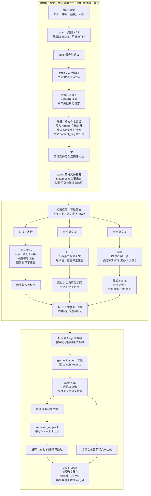
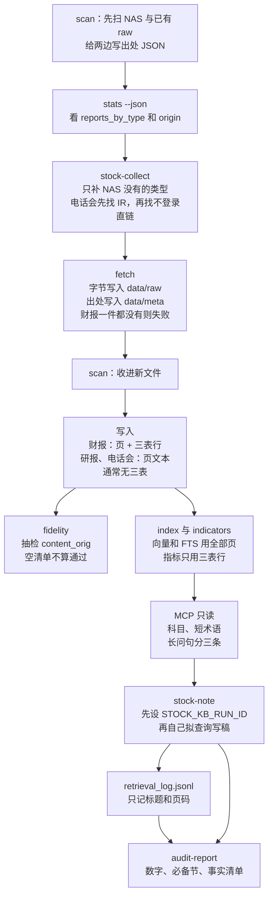
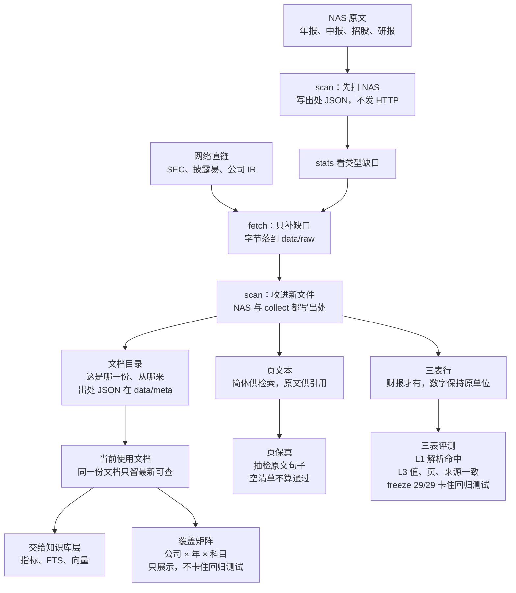

# 报告系统

入门说明在 [从零理解财报知识库与 RAG 评测](knowledge-base-rag-eval-tutorial.md)。这篇按代码里已经能跑的路径，写清三层各自做什么、数据怎么交到下一层、每层用什么检查验收。中文用词见 [术语库](glossary.md)。

交互图：

- [三层结构](diagrams/layers.html)
- [从原文到审计稿](diagrams/run.html)
- [证据层：输入、产物与验收](diagrams/evidence-io.html)
- [三类文件如何走完证据层](diagrams/evidence-files.html)

## 三层各回答什么

| 层 | 回答的问题 | 主要产物 | 评测 |
|---|---|---|---|
| 证据层 | 这句话还在不在原文里 | `reports` 文档目录、`pages`、`statements`、版本链 | 三表 29/29；`fidelity` 抽检 `content_orig` |
| 知识库层 | 问句该查科目、哪一页，还是没有答案 | `indicators`、FTS5、向量、MCP | 路由 24/24；keyword / hybrid semantic 的 Recall@5；分桶只展示、不足 5 题不卡住回归测试 |
| 报告层 | 稿子里的数能不能回到这次查询 | 扫描稿、`retrieval_log.jsonl` | `audit-report`。无 `run_id` 的旧稿只跳过，不算通过 |

三层之间是交接，不是同一次命令里混做。证据层不负责检索排序，知识库层不改原文，报告层不把判断写进财务表。

## 层级结构



证据层的当前使用文档条件是 非重复、`status` 为空或 `ok`，且标题不含「清单」或「清單」。`superseded`、`missing`、`failed` 不进默认检索。MCP `list_reports` 仍返回全部状态。

## 运行流程



对应命令：

```powershell
python -m stock_kb models download --model BAAI/bge-small-zh-v1.5
python -m stock_kb scan
python -m stock_kb stats --json
python -m stock_kb fetch --source sec --company 百胜中国
python -m stock_kb fetch --source hkex --company 海底捞
python -m stock_kb fetch --url "<文件直链>" --company 海底捞 --kind research --optional
python -m stock_kb scan
python -m stock_kb index --model BAAI/bge-small-zh-v1.5
python -m stock_kb indicators
python -m stock_kb fidelity
python -m stock_kb mcp --transport http --host 127.0.0.1 --port 8931
```

`fetch --source` 只在 NAS 没有最近一份年报、也没有最近一份中报时跑。只缺一件时用 `--url` 下那一份。规则见 `skill/stock-collect/SKILL.md`。

写稿前设置 `STOCK_KB_RUN_ID`。稿子里写一行 `run_id:`。然后：

```powershell
python -m stock_kb audit-report <稿子路径> --company 海底捞
```

收集规则在 `skill/stock-collect/SKILL.md`，写稿规则在 `skill/stock-note/SKILL.md`。财报用 SEC 或披露易。电话会先用公司 IR 上的文字稿直链；没有时，按该技能再收不登录就能打开的非官方会纪。研报只接受能直接打开的文件 URL，并加 `--kind research --optional`。不登录券商站，不绕过付费墙。披露易适配器在 `stock_kb/collectors/hkex.py`，失败写入 `data/collect_log.jsonl`。

公司目录都不存在、也没有因未变更而跳过的文件时，`scan` 退出码 2。目标年份的财报一件都没落到本机时，`fetch --source` 失败。研报或电话会单条失败只记日志。网页发现过程不进冻结回归测试。冻结回归测试只在维护者本机、库里已有试点数据时跑。

## 证据层

证据层回答：这句话还在不在原文里。它把 NAS 和 `data/raw` 里的文件写成可引用的页；财报再抽出三表行。验收用来证明这些产物还对得上原文。数值不在这一层换算成人读单位。

完整交互图见 [证据层：输入、产物与验收](diagrams/evidence-io.html)。

### 输入、产物和验收



| 方向 | 是什么 | 作用 |
|---|---|---|
| 输入 | NAS 公司目录；按缺口 `fetch` 到 `data/raw` 的直链 | 先扫 NAS，再补缺失类型。原文待在两个根目录，互不拷贝。`scan` 对两边都只读 |
| 产物 | `reports` 文档目录、出处 JSON、`pages`、财报的 `statements` | 下游只认库里的目录行。页同时留下简体和原文。三表行保持千元或百万美元 |
| 验收 | 三表 29/29；`fidelity` 抽检；覆盖矩阵 | 前两道卡住回归测试或明确「不算通过」。覆盖矩阵只展示缺口 |

当前使用文档条件是 非重复、`status` 为空或 `ok`，且标题不含「清单」或「清單」。`superseded`、`missing`、`failed` 不进默认检索。MCP `list_reports` 仍返回全部状态。

### 入库每一步在做什么

原文有两个根：NAS `nas.root/{公司}/`，以及 `collect.raw_dir/{公司}/`（默认 `data/raw/{公司}/`）。某一侧不存在就跳过该侧。公司目录都没有、也没有因未变更而跳过的文件时，`scan` 退出码 2。操作顺序见上文「运行流程」：先 `scan` NAS，用 `stats` 看缺口，再 `fetch`，再 `scan` 一次。

1. **先 `scan` NAS 和已有 `data/raw`。** 只读遍历，不发 HTTP，不往 NAS 或 `raw_dir` 写原文。按路径判定 `origin` 是 `nas` 还是 `collect`。出处 JSON 写到 `data/meta/{origin}/{公司}/{相对路径}.source.json`。跳过解析时也回填。
2. **用 `stats --json` 看缺口。** 看 `reports_by_origin` 和 `reports_by_type`。NAS 已有最近一份年报和中报，就不要跑 `fetch --source`。
3. **`fetch` 只补 NAS 没有的类型。** 字节写入 `raw_dir`，出处 JSON 写入 `data/meta/collect/{公司}/`。财报一件都没落到则失败。研报、电话会单条失败只记日志。
4. **再 `scan` 一次，收进新文件。** 先读 `meta_dir`；没有则读原文旁旧 sidecar，并写回 `meta_dir`。路径、sha、大小、mtime 都没变，且已按当前 `PARSE_VERSION`（`stock_kb/versioning.py`，现在是 `2026-10-02.1`）扫成功，就跳过。sha 相同但解析规则旧了，就地重解析。sha 变了才新开版本。
5. **读正文时按文件名分类。** 分类看文件名和父目录，不读 JSON 里的 `kind`。`--kind transcript` 的实际作用是给文件名加 `transcript-` 前缀。电话会关键词优先于研报；研报关键词再优先于年报、中报。
6. **写入文档目录，再写页和三表。** `reports.path` 唯一。查询、引用、版本选举都读这行。页和三表跟在后面，见下一节。
7. **同一份文档只留一条当前使用文档。** `logical_key` 不含 sha。财报的市场看文件名和标题，不看父目录：年报、年度报告、中报、中期报告是港股；Annual Report 且没有港股标记是美股。同一键下，`(retrieved_at, mtime, id)` 最大的一条保持 `ok`。相同 sha 标 `is_duplicate`。源文件从本次扫描的公司目录消失时，标 `missing`，不删行。扫描结束会按已存字段重算逻辑键，不重读原文。

`manifest` 只服务扫描：记住某条路径上次的 sha、大小、mtime。给人查询用的目录是 `reports`。

### 三类文件怎么走完这一层

交互图：[三类文件如何走完证据层](diagrams/evidence-files.html)。三类文件共享「落到本机 → 分类 → 成页 → 写入目录」；只有财报和招股再抽出三表。`scan` 给 NAS 和 collect 两边都写出处 JSON。


**财报与招股**要同时交出页和科目行。PDF 逐页提取；字少或 `(cid:` 过密的页走 OCR。xls 把整张矩阵当成第 1 页。页首能对上报表标题的页，再按行抽出三表。`exact-001` 走这条路：海底捞 2024 年报第 142 页的 42,754,687 千元，先写成 `statements`，再归到 `indicators.revenue`。

**研报**通常只有页。券商正文的页首对不上四表标题，`statements` 为空，不会因此多出一条营业收入。「翻台率」能命中研报页，是因为这些页进了 FTS。不同研报互不取代；只有同一 `source_url` 的新文件才替换旧的。

**电话会**也是页文本，不进三表。文件名或父目录命中电话会关键词后，每一页的 `page_kind` 都是 `transcript`。文字稿整篇是第 1 页。扫描不编造「问：」「答：」。会议日期取自文件名，写进 `logical_key`。因此电话会只能被 `search_reports` 引用到页。

页文本按扩展名来：

| 扩展名 | 页怎么来 | 三表 |
|---|---|---|
| `.pdf` | pdfplumber 逐页。字数低于 `ocr.min_chars` 的页走 OCR。成功页 `is_ocr=1`，质量不合格 `is_ocr=2` | 只处理页首 8 行能对上报表标题的页 |
| `.xls` | 整张矩阵拼成第 1 页 | 按文件名归利润表、现金流量表或资产负债表 |
| `.txt` `.md` `.html` `.htm` `.csv` | 整个文件是第 1 页，`is_ocr=0` | 不抽取 |

### 出处和目录在每一步做什么

也许你会先想到 metadata 就是一堆字段。顺着入库看，它们各自在替后面某一步说话。

- **落到本机时**：`fetch` 给网络文件写下地址和取回时间。`scan` 给 NAS 和 collect 都写或回填同一套 JSON。研报、电话会用地址区分「是不是同一份」。当前使用文档选举时先比取回时间。
- **决定重读时**：sha、大小、mtime、`PARSE_VERSION` 和 `manifest` 一起判断。字节没变但解析规则旧了，就地重解析，避免目录膨胀。
- **分类之后**：类型、年份、期间、语言写进目录行。检索可以按这些过滤；三表默认当年年报正文；指标按公司、年、期间归集。
- **写成页之后**：`content_orig` 给引用和保真抽检；`content` 给 FTS 和向量。`page_kind` 区分封面、目录、报表页、正文、电话会。
- **选出当前使用文档之后**：默认检索和指标只看非重复、`status` 为空或 `ok`，且标题不含「清单」或「清單」的行。旧版和目录清单仍在库里，MCP `list_reports` 仍能看到。

`origin` 区分文件在 NAS 还是 `data/raw`。`stats` 的 `reports_by_origin` 用它。检索、写稿目前不读这一列。笔记引用写 `《title》第N页`，不写 URL。

`--kind` 会写进 JSON，扫描不读。分类只看文件名和父目录。

### 报表页怎样抽出可引用的行

财报 PDF 是三表的主要来源。某一页要同时满足：

1. 页首 8 行里有一行，去掉「Consolidated」「Condensed」这类前后缀之后，能对上利润表、资产负债表、现金流量表或权益变动表的标题。附注页整页跳过。
2. 标题之下按行读取。行尾数字列要和该页识别出的年份列对齐。数字原样进 `value`。单位和币种从页首识别，海底捞常见千元、人民币，百胜常见百万美元。
3. 独立短横「–」占一个零值列，用来对齐，但不生成行项目。
4. 行名折行会拼回上一行。没有行名、整行只有数字的小计，只挂资产负债表白名单里的小节标题。`June 30` / `December 31` 这类月日表头不当科目。
5. `statements.is_ocr` 与页一致（0/1/2）。默认三表查询不返回 OCR 行。`indicators` 优先当年干净页，其次干净比较列；当年 OCR=1 仅当与比较列一致（或没有比较列）时提升。OCR=2 永不入选。OCR=1 页若标签列和数字列上下分开，按行序配对。

所以一份年报会同时有封面、目录、正文页，以及若干报表页和对应的三表行。后面的 `indicators` 只从这些三表行归收入、归母净利、资产、经营现金流。

### 产物怎样验收

证据层的评测在扫描之后、知识库检索之前。它们验证产物，不改原文。

| 检查 | 看什么 | 门槛 | 命令 |
|---|---|---|---|
| 结构化 L1 `parse_hit` | 对照页的 `statements` 里有这个数 | freeze 29/29，容差 0.0001，`golden_source: pdf` | `python -m stock_kb eval` |
| 结构化 L3 `hit` | 按科目词查出的行，值、来源、页与对照答案一致 | 同上，两列都要写 | 同上 |
| 页保真 | 非 OCR 页的句子必须出现在 `content_orig` | 缺了退出码 1。清单为空打印 `page_fidelity: skipped ...; not a pass`，退出码 0，这不是通过 | `python -m stock_kb fidelity` |
| 覆盖矩阵 | 公司 × 年份 × 五个核心科目是否有数 | 只展示，不卡住回归测试 | `python tools/coverage_matrix.py` |

当前 `eval/page_fidelity.yaml` 是 2026-10-03 首批财报 8、研报 8、电话会 1、OCR 4，2026-10-04 补招股书 2。库里目前只有一份当前使用的电话会文字稿。OCR 缺句只列入保真报告。

指标 12/12 在知识库层回归测试里，根仍是这里抽出的三表行。

### 字段速查

扫过之后，一份原文对应 `reports` 里的一行。NAS 和网络文件的出处 JSON 都在 `collect.meta_dir`。`sources` 表存三表页的引用定位（`《title》第N页`），目前由查询现场拼接。

`logical_key` 不含 sha。

- 年报、中报、三季报、招股：`{company}|{report_type}|{year}|{period_type}|{language}|{market}`
- 电话会：`{company}|transcript|{event_date}|{locator}`
- 研报：`{company}|research|{locator}`
- 其他：`{company}|other|{path}`，不同路径互不取代

研报和电话会的 `locator` 优先用 `source_url`，没有 URL 时用路径。内容变了：旧行路径改成 `{原路径}::superseded::{旧 sha 前 12 位}`，新行占用原路径。

| 字段 | 作用 |
|---|---|
| `path` | 这份文件现在的位置。表内唯一 |
| `sha256` / `size` / `mtime` | 认是不是同一份字节；扫描用来决定 skip、重解析还是新开版本 |
| `origin` | 文件在 NAS 还是 `collect.raw_dir`。`stats` 用它 |
| `source_url` / `retrieved_at` | 下载地址和取回时间。编进研报、电话会的 `logical_key`；选举当前使用文档时先比取回时间 |
| `report_type` / `year` / `period_type` / `language` | 分类。检索和三表、指标按这些收窄 |
| `logical_key` / `parse_version` / `status` | 版本链、解析规则版本、当前使用文档条件 |
| `title` | 给人看的文件名，也是引用里的书名号 |
| `pages.content_orig` / `content` | 原文供引用；简体供检索 |
| `pages.page_kind` | `cover` / `toc` / `statement` / `body` / `transcript` |
| `pages.is_ocr` | `1` 成功；`2` 质量不合格，默认检索排除 |
| `statements` 行名、原值、单位、币种、年份、页码 | 科目数字的来源 |
| `indicators.source_kind` | `own_year` / `comparative` / `ocr_own` / `derived` |

现有库可用 `python -m stock_kb stats --json` 看 `reports_by_origin`。写作本文时是 60 份 `nas`、4 份 `collect`。

## 知识库层

这一层决定问句走哪条查询，不改页文本。科目和全文检索是两条路。收入、归母净利、资产、经营现金流走 `get_indicators` / `get_financial_statements`（CLI 是 `indicators` 与 `statements`）。这些数先查表，不先做下面的混合检索。

`indicators` 从三表行名归出上述科目。`net_profit` 是归母：港股取「本公司拥有人应占」，美国取 `Net income — Yum China Holdings`。年内溢利合计不写入这个字段。挑选顺序是当年干净页、干净比较列、当年 OCR=1（须与比较列一致或没有比较列）。`source_kind` 标明 `own_year` / `comparative` / `ocr_own`；派生比率没有单独页码时 locator 为 `derived`，`source_kind` 同为 `derived`。

全文检索的实现在 `stock_kb/vector.py` 的 `hybrid_search`，关键词侧在 `stock_kb/search.py` 的 `fts_search`。入口决定会不会走进这个函数。

### 混合检索

三条入口：

1. CLI `python -m stock_kb search` 默认 `engine=fts`。只查整页 FTS。零命中保持空列表，不自动改走向量。要融合时加 `--engine hybrid`。
2. MCP `search_reports` 默认也是 `engine=fts`。先做 FTS。只要有页就返回，问句再长也不融合。零命中才调用 `hybrid_search`。模型或向量扩展加载失败时，这次调用吞掉异常，返回空列表。
3. 显式 `engine=hybrid`（CLI 的 `--engine hybrid`，或 MCP 参数 `engine=hybrid`）直接进入 `hybrid_search`。MCP 在默认 FTS 零命中之后的那次调用，走的是同一个函数。

`stock-note` 按这三条选工具：科目用指标或三表；短术语用 `engine=fts`；问句达到下面的长度，或 FTS 已经空手，再用 `engine=hybrid`。


长度门只存在于 `hybrid_search` 内部。归一化在 `search.normalize_query`：先 `to_simplified`，再把标点和括号收成空格，把 `2024年` 收成 `2024`。`翻台率` 仍是 3 字。`现金流质量` 是 5 字，所以 `search "现金流质量" --engine hybrid` 会进入这个函数，但 FTS 已有页时 `hybrid_fused` 为 false，结果就是那批关键词页。

长度达到 6，或者短查询的 FTS 为空，才同时取两侧。候选池是 `max(top_k * 4, 20)` 页。默认 `top_k=5` 时，每侧最多 20 页，融完再截回 5 页。向量索引还没建时，向量侧返回空列表，融合结果只含 FTS 页，但 `hybrid_fused` 仍是 true。这和长度门提前返回时的 false 不同。

两侧用同一组过滤。当前使用文档条件是 非重复、`status` 为空或 `ok`，且标题不含「清单」或「清單」。`is_ocr=2` 的乱码页不进结果。`year=` 是硬过滤。未传 `year` 时，问句里的四位年份同样按 `reports.year` 过滤。其中任何一个年份落到该公司当前使用文档的最小年与最大年之外，检索直接返回空。问句没有年份时，FTS 的 BM25 `rank`（越小越好）再除以 `1 + 0.015 * (今年 - 文档年)`，每年大约 1.5%，用来把近乎并列的跨年重复页分开。文档年取自 `reports.year`。

FTS 对 3 字及以上的问句把内容词 AND 起来。`是多少`、`怎么样`、`如何`、`是否` 等虚词不进 AND，年份本身也不进 AND。短于 3 字走 `pages.content LIKE`。恰好 2 个汉字且 LIKE 为空时，才查 `pages_bigram_fts`。bigram 不参与有结果时的排序。FTS 查询文本保持原句，不拼别名。

向量默认模型是 `BAAI/bge-small-zh-v1.5`，存在 sqlite-vec，距离是 L2。`pages.content` 按约 800 字、不重叠、按行打包写入 `chunks`（`embedding.chunk_size`，代码默认 `CHUNK_SIZE = 800`）。检索先取若干近邻块，再按 `page_id` 只留距离最小的一块。嵌入前 `_expand_bilingual` 会把表里的中英对和口语别名拼进问句。例如问句里有「真金白银」，嵌入文本会加上「经营现金流 现金流质量」；「翻台率」会加上 `table turnover`。这些词不写回 FTS。问句里的非常见词还要在块正文里出现，否则该页在向量侧被丢掉。

RRF 的名次从 1 开始。默认 `fts_weight = vec_weight = 1`，`rrf_k = 60`：

```text
fusion = 1 / (fts_rank + 60) + 1 / (vec_rank + 60)
```

只出现在一侧的页只加对应那一项。排序键是 `fusion_score` 从高到低，然后是向量距离 `score` 从小到大。页先被 FTS 写入、随后又被向量命中时，现有实现不会把 L2 抄进 `score`，并列时第二键按 `1e9` 处理。返回页带 `fts_rank`、`vec_rank`、`fusion_score`，`source` 为 `hybrid`，`hybrid_fused` 为 true。引用格式仍是 `《title》第N页`。

可以拿三句对照：

| 问句 | 归一化长度 | 显式 `engine=hybrid` 时 |
|---|---|---|
| 翻台率 | 3 | FTS 有页则不融合。写作本文时 CLI `--top-k 1` 命中《海底捞_研报-国信-202502》第 19 页 |
| 现金流质量 | 5 | 同样先看 FTS。有页则 `hybrid_fused=false` |
| 海底捞赚到的利润有多少能变成真金白银？ | 大于 6 | 做 RRF。嵌入侧额外拼上「经营现金流 现金流质量」，FTS 仍用原句 |

评测读返回值里的 `hybrid_fused`，不按问句长度自己猜有没有融合。keyword 题里大量短术语因此实际停在 FTS。hybrid semantic 的门衡量的是真正走过融合的那部分。

索引和查询日志：`pages.content` 进 FTS5 trigram。向量按上面的 800 字写入 sqlite-vec。MCP 以只读方式打开 SQLite。查询成功后把标题和页码追加到 `data/retrieval_log.jsonl`，不写整页正文，也不写进 `stock_kb.db`。

`route` 把问句分到指标、三表、检索或无答案。带年份的检索按 `reports.year` 过滤。路由的年份上界是该公司当前使用文档的最大年；1999 及更早直接无答案。没有传入上界时不设上界。

评测不把各层合成一个总 Recall。现行门：

- FTS keyword Recall@5 ≥ 0.75，Neg@5 ≤ 0.65
- hybrid semantic Recall@5 ≥ 0.20，Neg@5 ≤ 0.20
- 路由 accuracy = 1.0
- 无答案 empty_rate ≥ 0.75
- 指标 12/12

另外按桶打印 Recall@5：关键词、语义、跨语言、附注、无答案。某一桶少于 5 题时只打印 n，不因此让回归测试失败。`exact`、`indicator`、`route` 不进检索桶。命令是 `python -m stock_kb eval` 和 `python tools/run_eval_regression.py`。

## 报告层

这一层的成品是 agent 按 `skill/stock-note` 写的扫描稿。给人打开的默认格式是同名单文件 HTML，由 `python -m stock_kb render-note` 从 Markdown 生成。Markdown 留下供改稿，`audit-report` 两份都能读。`compose-note` 仍可出材料底稿和 ECharts 图，但不是回归测试门槛。`charts.py` 继续把已引用的序列画成图。

写稿前要有 `STOCK_KB_RUN_ID`。终稿要有：

- 一行 `run_id:`
- 必备节：利润表、资产负债、现金流、分红、总结
- 文末 `《标题》第N页`
- 判断句以「判断：」起头，开篇不下结论
- 同比或累计所在行写明算式

事实清单只有一份，`eval/fact_checklist.yaml`：收入序列、归母净利、净现金构成、现金流累计五件套、分红。每一项要么有注释，要么该节写「暂无数据」。库里已经有这个数时，不能整节只有「暂无数据」又没有任何注释。库里没有时，写「暂无数据」才通过。

`audit-report` 还检查：注释里的数字能在该页 `content` / `content_orig` 或三表行里找到；每条出处出现在该 `run_id` 的日志命中，或出现在该次返回的指标、三表行里。有两个及以上四位年份的利润表、资产负债、现金流，节内要有「图」，图旁数字要来自已引用数字。

回归测试里，`eval/generated_notes` 没有 `*扫描*` 稿时，打印 `audit-report: skipped (no agent report); not a pass`。已有稿但没有 `run_id:`，按旧稿跳过。这两种都不记失败，也不算通过。带 `run_id:` 的稿审计失败才卡住回归测试。措辞和观点仍按 `eval/HUMAN_RUBRIC.md` 人工看，不挡 `run_eval_regression.py`。

## 实例

问句：海底捞 2024 年营业收入是多少？

`eval/questions.yaml` 的 `exact-001`（`golden_source: pdf`）：

- 库内原值 `42754687` 千元，也就是 42,754,687 千元，币种 CNY，在损益表。
- 正出处是《2024年报》第 142 页。摘录为 `Revenue 收入 5 42,754,687 41,453,348`。
- 难负样本是《2023年报》第 278 页，那是比较列，不能当作 2024 年营业收入的出处。
- 人读：42,754,687 千元 = 427.54687 亿元。1 亿元 = 100,000 千元。稿子若写亿元，文末注释仍要回到这个千元原值和第 142 页。

它穿过三层的方式：

1. 证据层。`scan` 读 2024 年报，先写入一行 `reports`，再把第 142 页写入 `pages.content` 和 `content_orig`。损益表行写入 `statements`，值保持 42754687，不在解析时换成亿元。`indicators.revenue` 带上 `report_id` 和 `page_no`。
2. 知识库层。这是科目。`route` 走到指标或三表，不先做全文检索。MCP 对应 `get_indicators` / `get_financial_statements`。
3. 报告层。终稿注释写《2024年报》第 142 页。这次查询的 `run_id` 日志里要有这一页。`audit-report` 核对页上或三表里有 42754687。

另一条路径是检索。翻台率是 3 字，走 `search_reports` 的默认 FTS，不进 RRF。写作本文时，`python -m stock_kb search "翻台率" --top-k 1 --json` 命中《海底捞_研报-国信-202502》第 19 页。更长的经营叙述问句要显式 `engine=hybrid` 才会融合，规则见上面的「混合检索」。

## 后续再做

- RAPTOR / GraphRAG。只有某一检索桶稳定失败，并且报告必备节依赖该桶时，再单独立项。
- 不自动改写查询。日志留给以后整理零命中问句，本期不据此改问句。
