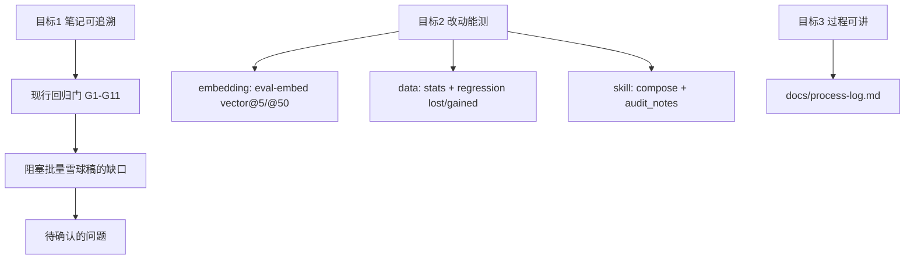

# 门槛合同：skill 笔记、改动评测、过程记录

把三个产品目标钉成可判定的 pass / fail 门。门的数字用现有 freeze / diag / generation 实测，不另发明 Recall 目标。

三个目标：

1. 用本仓库 RAG 与 MCP 只读工具，经 `stock-note` skill 批量产出雪球随笔风格笔记。
2. 评测能客观反映换 embedding、改 skill、加数据之后的效果。
3. 实施中的问题与解法可写进简历：现象、原因、解决、教训。

分层打分、题型、GT 规则仍以 [`eval/EVAL_SYSTEM.md`](EVAL_SYSTEM.md) 为准。本文只做目标到门的映射，以及「改哪一类东西、跑哪条测量路径」。

---

## 1. 编号门与 2026-08-30 实测

来源：[`eval/EVAL_SYSTEM.md`](EVAL_SYSTEM.md) §5。n=20 时 Wilson 区间很宽，门禁钉的是下限，不是把点估计抬到 0.9。

| 编号 | 检查 | 门槛 | 最近实测（2026-08-30） | 本目标状态 |
|---|---|---|---|---|
| G1 | FTS keyword Recall@5 | ≥ 0.75 | 0.80 | 过 |
| G2 | FTS keyword Neg@5 | ≤ 0.65 | 0.55 | 过 |
| G3 | hybrid semantic Recall@5 | ≥ 0.20 | 0.15 | **2026-09-04 复测 0.30，过**（2026-08-30 点估计 0.15；CI 当时 0.052–0.36） |
| G4 | hybrid semantic Neg@5 | ≤ 0.20 | 0.00 | 过 |
| G5 | 结构化 hit / parse_hit | 29/29 | 29/29 | 过 |
| G6 | FTS diag indicators | 12/12 | 12/12 | 过 |
| G7 | FTS diag no_answer empty_rate | ≥ 0.75 | 1.00 | 过 |
| G8 | hybrid diag no_answer empty_rate | ≥ 0.75 | 1.00 | 过 |
| G9 | route accuracy | = 1.0（24 题） | 1.00 | 过 |
| G10 | year_filter precision_mean | ≥ 0.60（4 题） | 1.00 | 过 |
| G11 | generation_compose | fail_count = 0；引用页含该数 | 1.00 faithful | 过（无 LLM 填模板） |

`audit_notes.py` 另检手写试点笔记：0 项失败、净利走归母。它进 `python tools/run_eval_regression.py`，不单独占一行门槛数字。

### 1.1 三个目标分别看哪些门

| 目标 | 已经能交差的门 | 还挡着批量雪球稿的缺口 |
|---|---|---|
| 1. skill 笔记（数字可追溯） | G5 结构化、G6 指标、G7/G8 无答案、G9 路由、G10 年份、G11 组稿引用 | 真语义 / 跨语言 miss@50；hybrid 短于 6 字只走 FTS；MCP `search_reports` 默认 `engine=fts`；模板组稿 ≠ LLM 写的 1,500–3,000 字观点稿 |
| 2. 改动评测 | 见第 2 节三条测量路径 | LLM 写的观点 / 同行对比 / 估值节尚未设门 |
| 3. 过程记录 | [`docs/process-log.md`](../docs/process-log.md) 已按「现象 / 原因 / 解决 / 教训」在记 | 新坑继续追加同一文件，不另开简历稿 |

G1–G11 全绿，只说明「科目数字能回到文件+页、短术语能搜到、库外问句能空、模板填数不编造」。它不说明 agent 已经能批量写出可发布的雪球随笔。

---

## 2. 按改动类型走哪条测量路径

改一类东西只看对应路径。禁止用 FTS keyword Recall 给 embedding 打分，禁止用「总 Recall」概括三层。

### Embedding-change measurement（换 embedding 模型）

主指标是 **vector@5 / vector@50 分桶**（top5 / 6–50 / miss），命令是 `python -m stock_kb eval-embed`。套件是 44 道会长句（freeze semantic 20 + freeze 无三表 cross 6 + diag semantic 8 + diag cross 10）；问句归一化后短于 6 字的排除。

不用 FTS keyword 当选模分数：keyword 评测会剥公司名，hybrid 对短于 6 字的查询短路回 FTS，测不到向量。

判定标签见 [`EVAL_SYSTEM.md`](EVAL_SYSTEM.md) §5.1：只有 `better`（Recall@50 的 Wilson 区间与基线分开且更高）才考虑改 `config.yaml` 的 `embedding.model`。`indistinguishable` / `lean_better` / `better_at_5_only` 不够。换模落地顺序：`eval-embed` 得 `better` → `python -m stock_kb eval --engine hybrid --model <候选> --split freeze` 过 G3/G4 → `python tools/run_eval_regression.py`。

当前默认模型 `BAAI/bge-small-zh-v1.5` 在该套件上：Recall@5 = 0.159，Recall@50 = 0.364，miss = 28/44。这是诊断数，不进 G1–G11。

### Skill-change measurement（改 skill / 生成笔记）

改 `skill/stock-note/`、组稿模板、或试点 Markdown 笔记时：

1. `python -m stock_kb eval-generation`（`compose-note` 按 skill 工具顺序填模板；财务摘要每个数字必须出现在引用页的 `pages.content` / `content_orig`；组合口径数字（如海底捞总资产）允许「页内两数之和」核对）。
2. `python tools/audit_notes.py`（手写试点笔记的数字与 `《文件》第N页` 对库）。
3. `python tools/audit_formal_notes.py`（**正式稿**程序化审计：正文 [n]↔注释表对应、注释页码存在、数值列数字在引用页可追溯（含两数之和与亿元换算 2% 容差）、正文无页码残留、HTML 有图、行情带日期；行情/汇率等非页面出处单独披露不判败）。
4. 三者都进 `python tools/run_eval_regression.py`。门槛是 G11：fail_count = 0，faithful_rate = 1.00（样张缺失时正式稿审计自动跳过）。

**LLM 观点层（判断段、估值推演、心算复核）尚未设门。** 正式稿的可追溯面（注释/出处/页内数字）已自动审计，观点与算式仍靠人工 rubric（R1/R2/R11）。[`EVAL_SYSTEM.md`](EVAL_SYSTEM.md) §6 明确不采用 LLM judge。

**引用格式契约（2026-09-13 起）**：MCP 全部工具（`get_financial_statements` / `get_indicators` / `get_source_excerpt` / `search_reports`）与组稿统一返回 `《title》第N页` locator；派生指标（无页码）标 `derived`。审计正则只认此格式，新工具必须遵守。

### Data-add measurement（添加数据）

入库新报告、新公司、或重解析之后：

1. `python -m stock_kb stats --json`：报告数 / 页数 / 三表行 / 指标是否按预期增加；未改解析器时旧公司数字不应无故下降。
2. `python tools/run_eval_regression.py`：对照 [`eval/regression_baseline.json`](regression_baseline.json) 打印每题 lost / gained。翻题默认只打印，不单独当失败。
3. 问句带新年份时看 G10；库外实体仍须 G7/G8 empty_rate。

改 GT 或题集且门槛仍过，再用 `--write-baseline`。禁止把 DB 里的 `statements.value` 抄回 `questions.yaml` 当 golden。

---

## 3. 阻塞批量雪球风格笔记的缺口

这些缺口本里程碑**不修**。列在这里是为了把「G1–G11 全绿」和「能批量发雪球」分开。

1. **diag / embed miss@50（真语义与跨语言）。** 证据清单之后仍有约 11 道页不在向量 top-50；44 道长句 miss 28/44。英文问中文页、附注减值仍常打到封面或目录。FTS diag semantic Recall = 0.0。
2. **hybrid 短查询**（2026-09-13 更新）：`len(query) < 6` 仍关键词优先，但 **FTS 零命中时自动走向量融合兜底**（`vector.hybrid_search`）；评测读取检索器返回的 `hybrid_fused` 标志，不再按长度预测。
3. **MCP 默认检索引擎仍是 FTS，零命中自动升引擎。** [`search_reports(..., engine="fts")`](../stock_kb/serve/mcp_server.py) 与组稿 `fetch_operating_hits()` 默认 `fts_search`，零命中时自动 hybrid 兜底（向量索引缺失时静默降级为空）。无年份问句的 FTS 排序带 1.5%/年新近度软因子（仅打散跨年份重复页并列）。
4. **生成评测不打 LLM 是否遵守 skill。** G11 覆盖工具顺序和「数字在引用页上」。skill 要求 1,500–3,000 字、观点层与事实层分开、同行对比、估值假设：这些还没有自动门。
5. 相邻、不挡数字可追溯：两字 `pages_bigram_fts` 排序未启用；US/HK 年报语义重复未标 canonical；路由越界年份写死 `>= 2026`。

评测已试过、明确不要当下一刀：再切 400 字块（freeze hybrid semantic 0.10→0.05 已回滚）；页不在 top-50 时先上 reranker；用整句语言 ID 切中/英引擎；扩到 170 题 / LLM judge / Coverage-Diversity 当优化目标。

---

## 4. 笔记风格杠（雪球样稿已读到）

指定帖：https://xueqiu.com/7305934056/407721579 。无头 HTTP 被 Aliyun WAF 挡住；jina 停在雪球验证码；Wayback / Google 缓存无快照。2026-09-04 用 Playwright 真 Chrome 读到全文，整理在 [`eval/style-canon/xueqiu-407721579.md`](style-canon/xueqiu-407721579.md)。

用户原链是《安井食品扫描》。同一专栏里「扫描」和「笔记」共用一套骨架；PLAN 里的《中国金茂笔记》也是这位作者（https://xueqiu.com/7305934056/403975353）。6 篇对照见 [`eval/style-canon/TEMPLATE.md`](style-canon/TEMPLATE.md)。

稳定顺序：股票标签 →（股东/激励）→ 利润表 →（分产品/地区）→ 资产负债（净现金写公式）→ 现金流与分红 →（行业/同行）→（看点）→ 总结用 PE × 派息率算股息率。没有开篇「一句话结论」；估值多半在总结里；风险可有可无。数字没有「文件 + 页码」。产品承诺仍要求可追溯，所以学结构、不学无出处。

对照仓库金茂 13 节模板（[`PLAN.md`](../PLAN.md) §9、[`note_template.md`](../skill/stock-note/templates/note_template.md)）：应改成扫描体，而不是继续扩 13 节。

`compose-note` 已按扫描体出 Markdown + 单文件 HTML（vendored ECharts，SVG renderer；空序列不进图例）。引用明细表进 `eval-generation`（faithful_rate=1.0），并对「趋势：」句做人读口径一致性自检（趋势句的「N 亿元/亿美元」必须能对上出处表原值换算，mismatch>0 即 fail）。无市价不算 PE。试点手写笔记仍用 `audit_notes.py`。

2026-09-12 起组稿底稿新增：带出处趋势句、五列出处表（指标/年份/数值/单位/来源；HTML 另加同比列）、总结公司级事实复述；人工风格门见 [`HUMAN_RUBRIC.md`](HUMAN_RUBRIC.md) R8–R11。

本阶段范围：海底捞、百胜中国两家用 skill 产出扫描体报告；其他公司入库后作测试集，不拿来刷现有 freeze。

---

## 5. 已锁定的决策（2026-09-04）

编号按讨论清单。用户回复 8=公司范围、9=生成评测层。

| # | 决策 | 锁定 |
|---|---|---|
| 1 | 本阶段完成标准 | **B**：skill 按扫描体出报告；组稿提供可审计材料；财务数字须能对上引用页 |
| 2 | 观点 / 看点 / 风险 | **C**：允许模型判断，须标成判断，不得写入财务表 |
| 3 | 估值 / 市价 | 独立行情工具（yfinance 优先，akshare 兜底）。最新收盘价与市值；利润 **TTM**；先按财报币种算 PE，再用实时汇率给人民币。行情失败则**整篇失败**。不写入 `stock_kb.db` |
| 4 | 图的完整度 | **拆开**：净现金/总资产/股息入库再画；股东结构、分产品由 agent 从带出处页抽取，不写生产库 |
| 5 | MCP 默认引擎 | **维持 FTS**。LLM 拆问题后按 skill 调工具；需要语义时再显式 `engine=vector` / `hybrid` |
| 6 | hybrid semantic 门槛 | **上抬 G3 至 ≥ 0.20**（eval hybrid 路径；MCP 默认仍 FTS）。质量考核语义检索，不改产品默认引擎 |
| 7→用户8 | 公司范围 | **A**：本阶段只海底捞、百胜中国。其后新公司当测试集，不改 freeze GT 刷分 |
| 8→用户9 | 生成评测 | G11 自动引用门保持；**人工 rubric 挡发布、不挡** `run_eval_regression.py`。清单见 [`HUMAN_RUBRIC.md`](HUMAN_RUBRIC.md)。审核人：用户。过关：扫描体八节、判断已标注、财务表无判断、无表外无出处数字、HTML 有图 |
| 运行时 | skill | 指定公司后 skill 直接出 HTML 扫描稿；细节可自由发挥，数字纪律不可自由发挥 |

---

## 6. 简历可讲的过程记录

指定文件：[**`docs/process-log.md`**](../docs/process-log.md)。

文首用途句：「复盘本机试点（海底捞 + 百胜中国）全过程中的问题与解法」。条目体例是 **现象 / 原因 / 解决 / 教训**（例如第 1 条 NAS 沙箱 Access denied、第 5 条 FTS5 中文 trigram、第 11 条 `--rebuild` 误删多模型索引）。

新的检索、解析、评测坑继续追加同一文件。不要另起一份「简历故事」文档，避免和评测过程稿 [`eval/EVAL_PLAN.md`](EVAL_PLAN.md) 抢同一段历史。

---

## 7. 本阶段明确不做

- 重切 chunks、先上 reranker、更换默认 embedding（除非 `eval-embed` 得 `better` 且 freeze hybrid 仍过门）。
- 把行情、股东穿透写进 `stock_kb.db` 当财报事实（行情走独立工具；股东/分产品由 agent 带出处抽取，待决）。
- 克隆雪球原文措辞；采用 LLM-as-judge、170 题切分、Coverage / Diversity。
- 本阶段在两家试点之外用新公司刷 freeze。
- 把「改到未来每一项指标全绿」当作通过条件。
